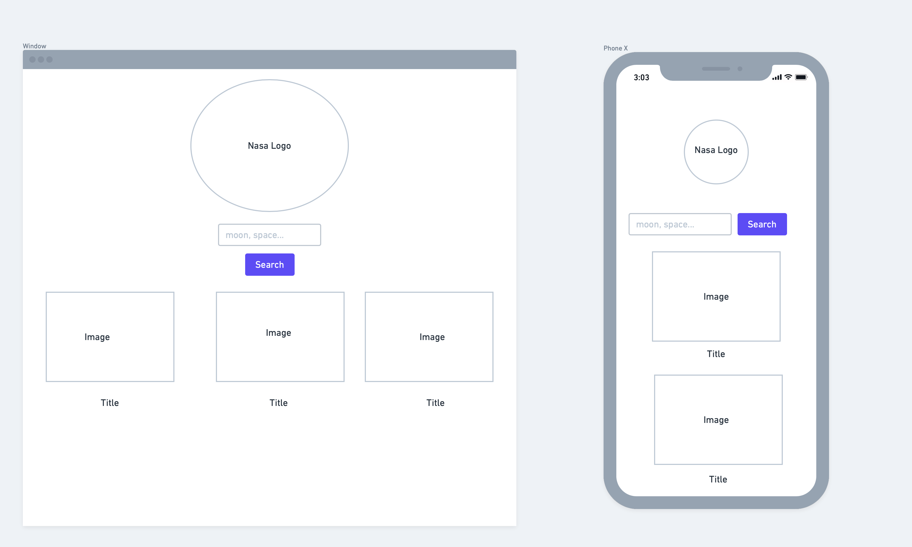
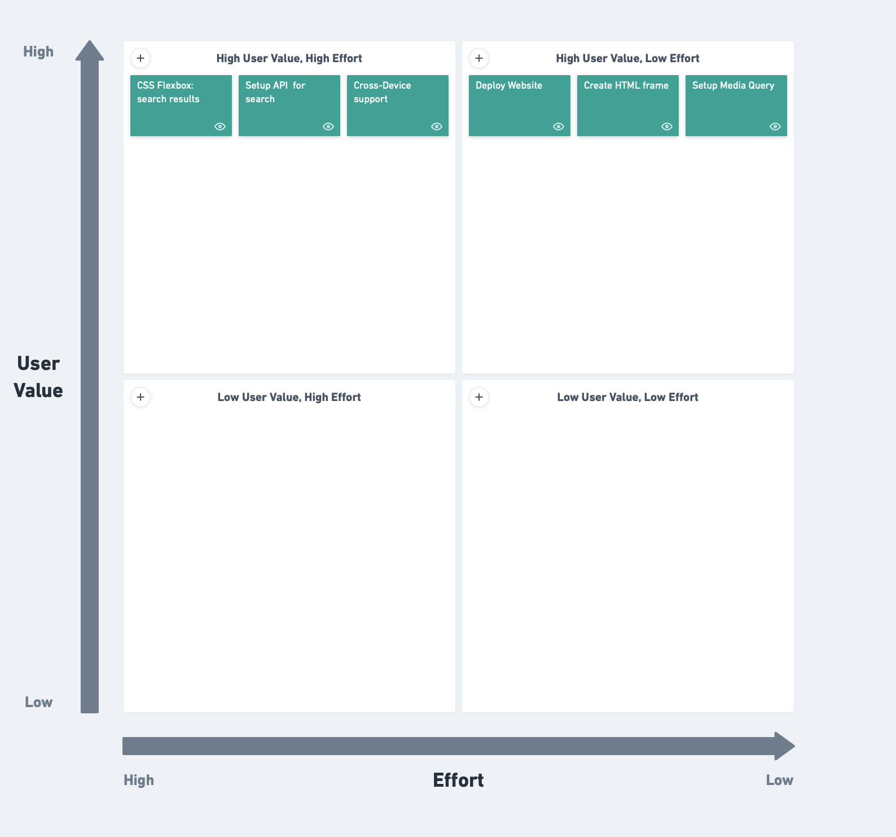

# Space Search
This application will display images the user searches for from the NASA images database on mobile and desktop devices.

## API
I will be using the public NASA API.

https://api.nasa.gov

```javascript
{
    "date": "2021-08-02",
    "explanation": "Have you heard about the Hubble Ultra-Deep Field?  Either way, you've likely not heard about it like this -- please run your cursor over the featured image and listen!  The Hubble Ultra-Deep Field (HUDF) was created in 2003-2004 with the Hubble Space Telescope staring for a long time toward near-empty space so that distant, faint galaxies would become visible.  One of the most famous images in astronomy, the HUDF is featured here in a vibrant way -- with sonified distances. Pointing to a galaxy will play a note that indicates its approximate redshift. Because redshifts shift light toward the red end of the spectrum of light, they are depicted here by a shift of tone toward the low end of the spectrum of sound.  The further the galaxy, the greater its cosmological redshift (even if it appears blue), and the lower the tone that will be played. The average galaxy in the HUDF is about 10.6 billion light years away and sounds like an F#. What's the most distant galaxy you can find?   Note: Sounds will only play on some browsers.  This week at NASA: Hubble #DeepFieldWeek",
    "media_type": "video",
    "service_version": "v1",
    "title": "The Hubble Ultra Deep Field in Light and Sound",
    "url": "https://apod.nasa.gov/apod/image/1803/AstroSoM/hudf.html"
}
```

## Wireframe 


## MVP 
- Fetch image and title from NASA's API and display search results.
- Set up media query for smaller devices.
- Use Flexbox to style the website and organize content.
- Deploy on GitHub Pages.


## Post-MVP
- Add function to save images in browser session
- Create a function that changes background of page to desired image from NASA database.


## Priority Matrix


## Timeframes
| **Component**             |Estimated Time| Time Invested | Actual Time |
| :------------------------ | :-- | :-- | :-- |
| Create  HTML frame         |  3 hrs| 1hr| 1 hr |
| Setup API                 |4 hrs |10 hrs | 10 hrs|
| Setup media query        |  3 hrs| 1 hr| 1hr|
| CSS styling search results | 5hrs| 4 hrs| 4 hrs |
| Setting up cross-device support |2 hrs |3 hrs | 3hrs|
| Deploy                    | 3hrs |1 hr | 1hr|
|Total:  |20hrs| 20 hrs| 20 hrs|

## Code snippet
```javasciptt
function displayData(dataArray) {
  dataArray.forEach((result) => {
    let nasaData = `
    <div class="searchResult">
      
      <h4>${result.data[0].title}</h4>
    </div>
    `;
    results.insertAdjacentHTML("beforeend", nasaData);
  });
}
```